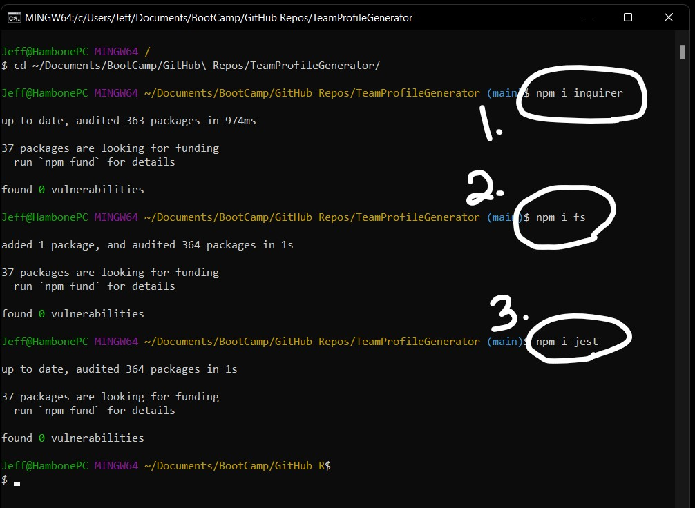
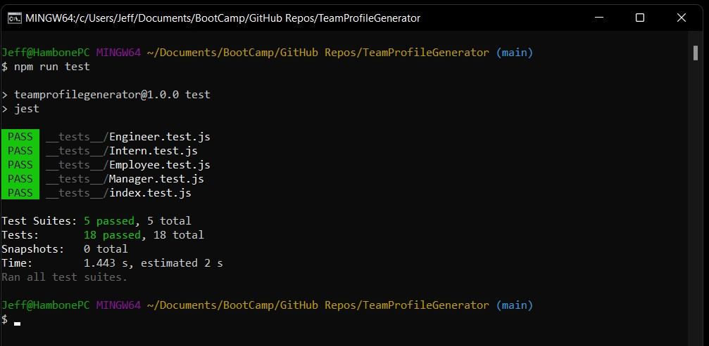
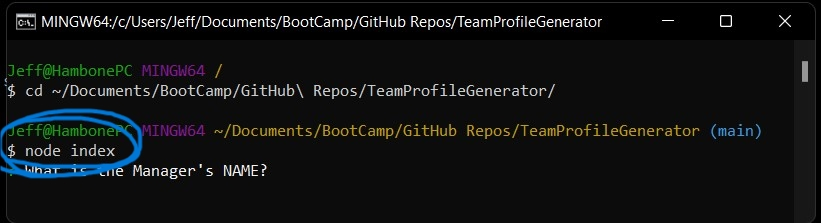
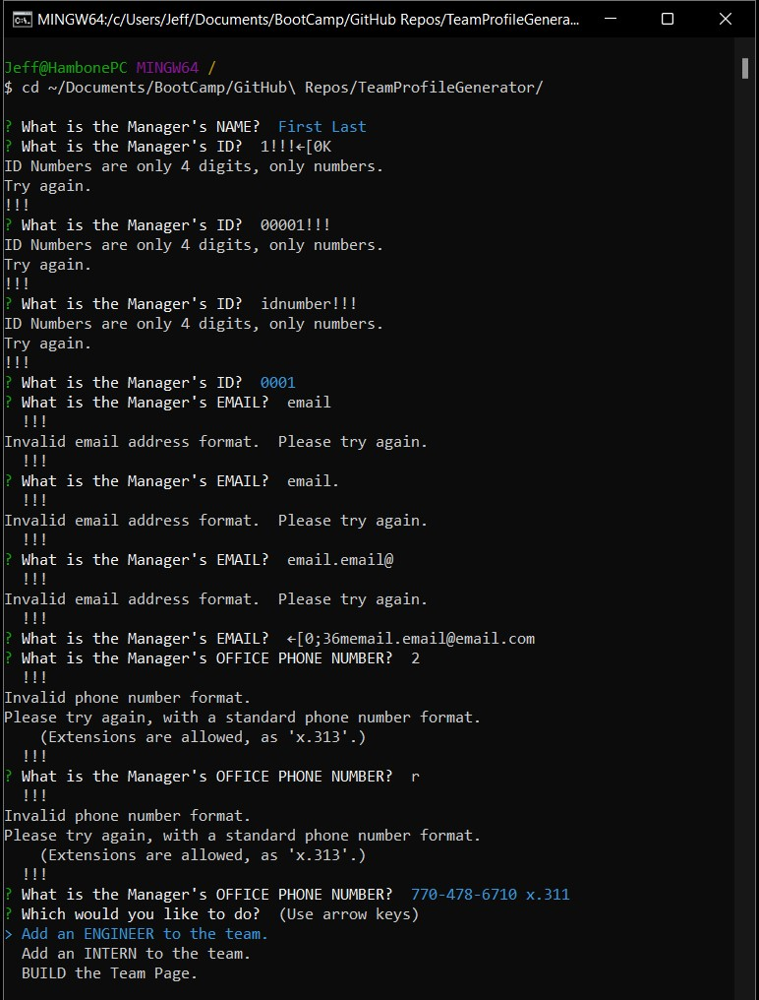
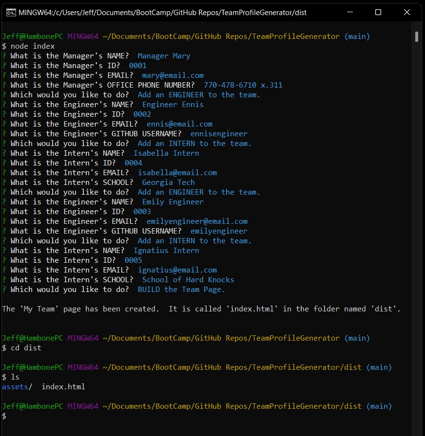
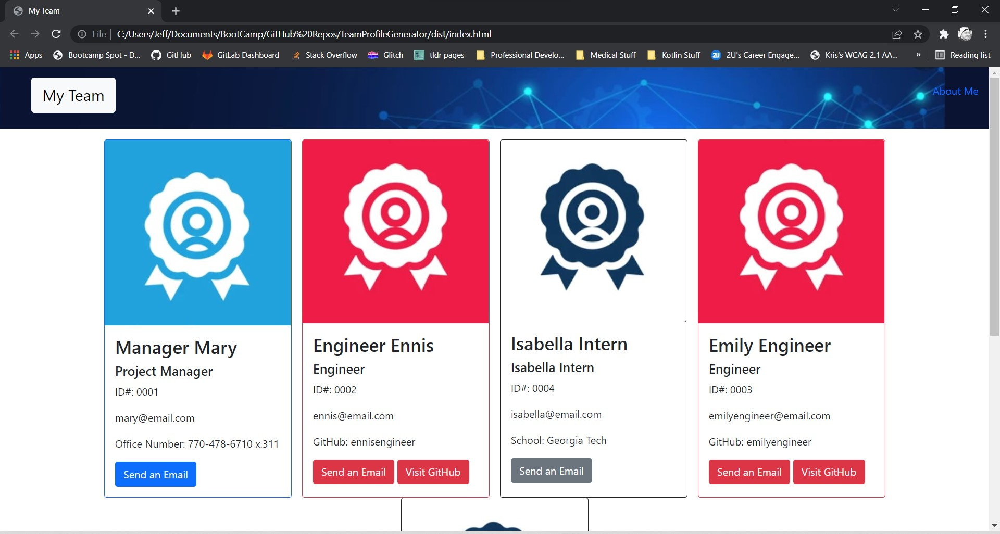

# TeamProfileGenerator

## Video Demonstrations
- Basic Operation (including some input validation):  https://drive.google.com/file/d/119xEK6UUBYTmhLBfToFvKQdqKlIqmrFB/view
- Jest to Run Tests:  https://drive.google.com/file/d/1NXitf-r2X-6CBIh0xgWflBlhsvEORb3E/view

## Project Description
This application will receive user input using the Command-Line Interface (CLI) to generage an HTML page with team members, their roles, contact info, and other information about them.

## Instructions before Use
- Install dependencies.    

- Run tests to ensure successful run-program.    

## Using the Program
- From the main folder of the app, run the command 'node index'.    

- The app will help you, if there are any 'wonky' inputs.  Validation is quite strict.    

- Step through all the questions, and a "success" message will display when an HTML file is created.    

- A full HTML page is created with all the user-input data.    

